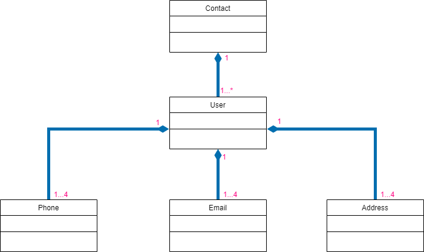

# Contact-Manger-Application
## Console C++ OOP Projet 
This console-based C++ project is designed for managing a list of users. Each user is characterized by a unique ID, name, gender, and can have 1-4 email addresses, 1-4 addresses, and 1-4 phone numbers.
## Features
- **User Management:** Add, update, and delete user information.
- **Data Persistence:** User details are stored in text files within the "DataBase" folder.
- **Object-Oriented Programming (OOP):** Efficiently organized code using OOP principles.
## UML

